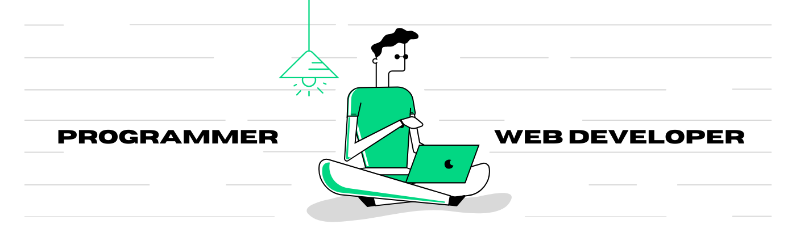

<h2>Hey there! I'm Krishna</h2>

<!-- ## 👋 &nbsp;Hey there! I'm Krishna -->

### 👨🏻‍💻 &nbsp;About Me

💡 &nbsp;I like to explore new technologies and develop software solutions and quick hacks.\
🌱 &nbsp;My area of interest are Front end Web Development, python programming, Deep learning, embedded systems.\
✉️ &nbsp;You can shoot me an email at kgn272000@gmail.com! I'll try to respond as soon as I can.\
📄 &nbsp;Please have a look at my [Resume]() for more details about me. I'm open to feedback and suggestions!

### 🛠 &nbsp;Tech Stack

&nbsp;

&nbsp;
&nbsp;

&nbsp;
&nbsp;
&nbsp;

&nbsp;
&nbsp;

&nbsp;
&nbsp;
&nbsp;
\
&nbsp;
&nbsp;
\
&nbsp;

&nbsp;

### 🤝🏻 &nbsp;Connect with Me

